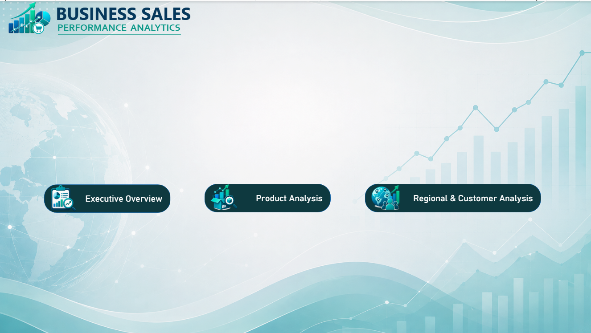
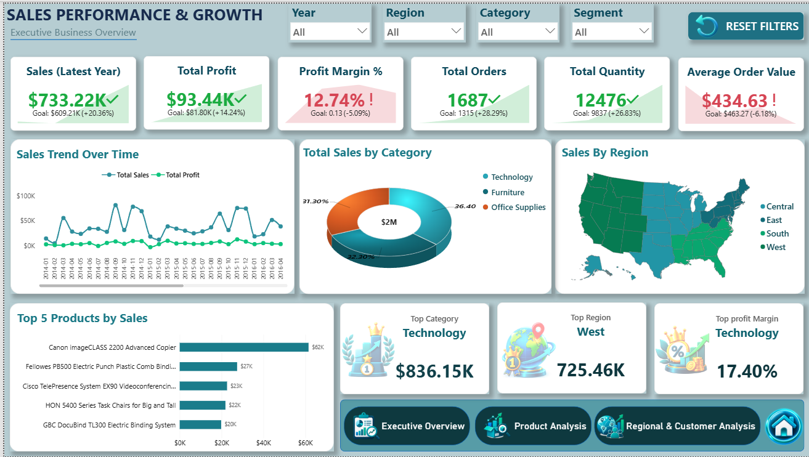
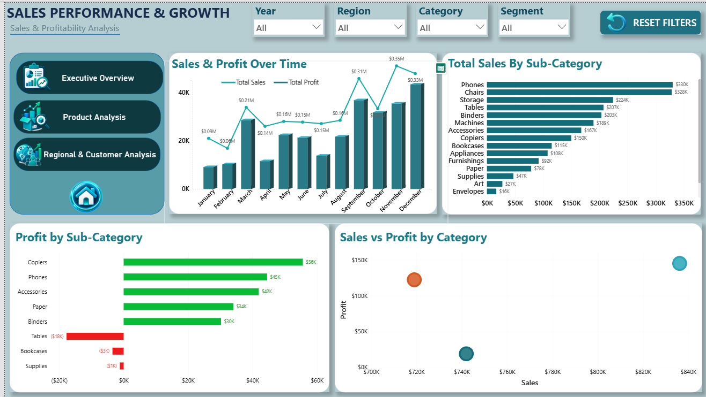
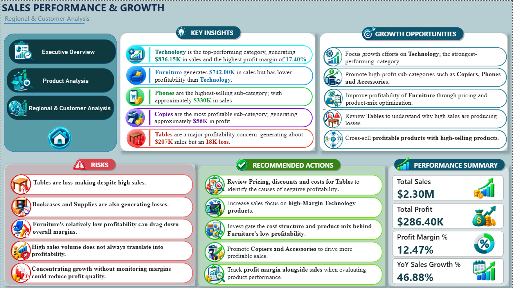

# FUTURE_DS_01

## Future Interns – Data Science & Analytics | Task 1
### Business Sales Performance Analytics

---

## 📌 Project Overview

This project was completed as part of the **Future Interns Data Science & Analytics Internship – Task 1**.

The objective of this project is to analyze business sales data and build a professional, client-ready dashboard that helps understand sales performance, profitability, product performance, and regional performance.

The analysis focuses on identifying trends, high-performing categories and products, profitability concerns, and actionable opportunities for business growth.

---

## 🎯 Objectives

The key objectives of this project are:

- Clean and organize the raw sales data.
- Analyze revenue and sales trends over time.
- Identify top-selling products and sub-categories.
- Compare category and regional performance.
- Analyze sales and profitability.
- Identify loss-making sub-categories.
- Create a professional and interactive business dashboard.
- Generate clear business insights and actionable recommendations.

---

## 🛠️ Tools & Technologies

- **Power BI**
- **Power Query**
- **DAX**
- **Data Visualization**
- **Business Analytics**

---

## 📊 Dashboard Overview

The dashboard contains three major analytical sections:

### 1. Executive Overview

The Executive Overview provides a high-level summary of business performance using:

- Sales
- Total Profit
- Profit Margin %
- Total Orders
- Total Quantity
- Average Order Value
- Sales trend over time
- Sales by category
- Sales by region
- Top 5 products by sales

### 2. Product Analysis

The Product Analysis page focuses on product and sub-category performance through:

- Sales & Profit over time
- Sales by sub-category
- Profit by sub-category
- Sales vs Profit by category

### 3. Regional & Business Insights

The final analysis section presents:

- Key business insights
- Growth opportunities
- Business risks
- Recommended actions
- Overall performance summary

---

## 📈 Key Performance Indicators

The dashboard highlights the following overall KPIs:

| KPI | Value |
|---|---:|
| Total Sales | $2.30M |
| Total Profit | $286.40K |
| Profit Margin | 12.47% |
| YoY Sales Growth | 46.88% |

Additional KPIs include:

- Latest Year Sales
- Total Orders
- Total Quantity
- Average Order Value

---

## 🔍 Key Insights

### Technology – Top Performing Category

**Technology** is the top-performing category, generating approximately **$836.15K in sales** and achieving the highest profit margin of **17.40%**.

### Furniture – Lower Profitability

**Furniture** generates approximately **$742.00K in sales**, but its profitability is lower compared with Technology.

### Phones – Highest-Selling Sub-Category

**Phones** are the highest-selling sub-category, generating approximately **$330K in sales**.

### Copiers – Highest Profit

**Copiers** are the most profitable sub-category, generating approximately **$56K in profit**.

### Tables – Major Profitability Concern

**Tables** generate approximately **$207K in sales**, but result in an approximately **$18K loss**, making them a significant profitability concern.

---

## ⚠️ Business Risks

The analysis highlights the following risks:

- Tables are loss-making despite having high sales.
- Bookcases and Supplies also generate negative profits.
- Furniture has comparatively lower profitability.
- High sales volume does not always translate into high profitability.
- Focusing only on sales growth without monitoring profit margins may reduce overall profit quality.

---

## 🚀 Growth Opportunities

Based on the analysis, the following growth opportunities were identified:

- Focus growth efforts on the **Technology** category.
- Promote high-profit sub-categories such as **Copiers, Phones, and Accessories**.
- Cross-sell profitable products with high-selling products.
- Improve the profitability of Furniture through pricing and product-mix optimization.
- Investigate loss-making sub-categories to improve overall margins.

---

## 💡 Recommended Actions

1. Review **pricing, discounts, and costs** for Tables to identify the causes of negative profitability.
2. Increase sales focus on **high-margin Technology products**.
3. Investigate the cost structure and product mix behind Furniture's lower profitability.
4. Promote **Copiers and Accessories** to drive more profitable sales.
5. Track **profit margin alongside sales** when evaluating product performance.

---

## 📸 Dashboard Preview

### Dashboard Home



### Executive Overview



### Product Analysis



### Regional & Business Insights



---

## 📂 Project Structure

```text
FUTURE_DS_01/
│
├── README.md
│
├── Dataset/
│   └── Superstore_Sales_Dataset.csv
│
├── Screenshots/
│   ├── Dashboard_Home.png
│   ├── Executive_Overview.png
│   ├── Product_Analysis.png
│   └── Regional_Customer_Analysis.png
│
└── Documentation/
    └── Business_Insights.pdf
```
